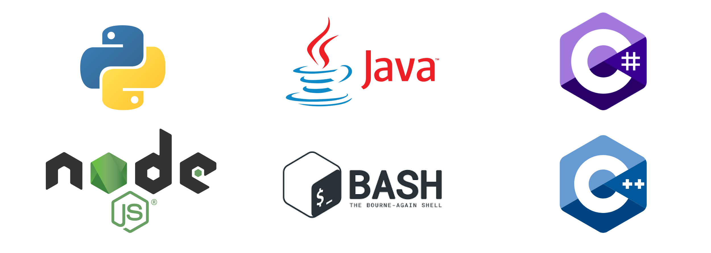
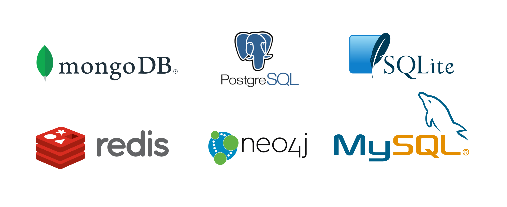

<h1 align="center">Bachelor's Degree in Software Development</h1>

<em>With a passion for modern and innovative technologies</em>

Hi, and welcome to my GitHub! :)

## Technologies

### Languages

### Databases

## Grades

### Software Develpment 2020-2021
| Date | Exam | Grade (DK) | Grade (Intl) |
| --- | --- | :-: | :-: |
| June 2020 | Advanced Databases | 12 | A |
| June 2020 | Software Testing | 12 | A |
| Maj 2020 | Machine Learning & AI | 12 | A |

### Computer Science 2017-2020
| Date | Exam | Grade (DK) | Grade (Intl) |
| --- | --- | :-: | :-: |
| Januar 2020 | Final Exam Project | 10 | B |
| Januar 2020 | Elective, Average | 12 | A |
| October 2019 | Internship | 12 | A |
| June 2019 | Elective, Fullstack JavaScript | 12 | A |
| June 2019 | Elective, Internet of Things | 12 | A |
| June 2019 | Elective, Python | 12 | A |
| Januar 2019 | Programming | 10 | B |
| December 2018 | System Development | 10 | B |
| June 2018 | Firstyear Average | 12 | A |
| June 2018 | Firstyear test, part 2 | 12 | A |
| December 2017 | Firstyear test, part 1 | 10 | B |
