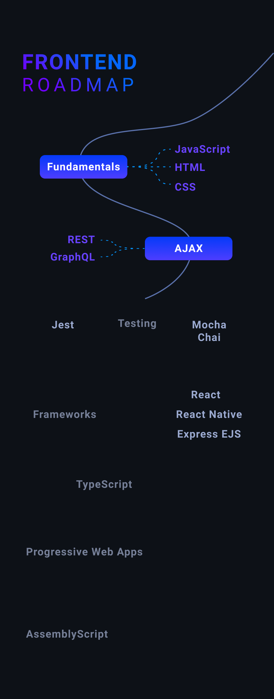

<h1 align="center">Bachelor's Degree in Software Development</h1>

<em>With a passion for modern and innovative technologies</em>

Hi, and welcome to my GitHub! :)  

<!--
Figma Images:
- Icons, height: 64px (crop whitespace)
- Cover, padding: 15px 
-->

I'm a simple guy loving to code and be challenged with new technologies.  
My favorite data processing tool is python together with pandas and numpy can nothing reach it.
For fullstack applications my favorite stack is MERN with TypeScript.

### Resume
* **HTX, Mathematics & Physics**
  * Electives (Electronics & Programming)
* **CPHBusiness, Computer Science**
  * Electives (Fullstack JavaScript, Python & Internet of Things)
* **CPHBusiness, Softwaredevelopment**
  * Electives (Machine Learning, Artificial Intelligence & Business Intelligence)

> [Go to my Grades](#Grades)

#### Next Milestone
My plan is to take a Master of Science in [Digital Innovation and Management](https://en.itu.dk/programmes/msc-programmes/digital-innovation-and-management) at the IT University of Copenhagen.

Below are a better image of me, current grades and known technologies, feel free to check it out.

<em>Click to show profile</em>

  

  
    

 

  <a href="https://www.linkedin.com/in/stephan-duelund-djurhuus/">

    
      Contact Me   
  </a>

## Favorite Stack

## Languages

## Databases

## Machine Learning Frameworks & Libraries

<!-- 
## Tools
Jupyter Notebook, Visal Studio Code, Digital Ocean, Visual Studio for Mac, IntelliJ, GitHub, GitHub Actions (CI), SSH, Docker, kubernetes, Vagrant
-->

## Grades

### Software Develpment 2020-2021
| Semester | Exam | Grade (DK) | Grade (Intl) |
| --- | --- | :-: | :-: |
| Fall 2020 | Large System Development | 12 | A |
| Fall 2020 | System Integration | 12 | A |
| Fall 2020 | Investigation & Reporting | 10 | B |
| Fall 2020 | Business Intelligence | 10 | B |
| Spring 2020 | Advanced Databases | 12 | A |
| Spring 2020 | Software Testing | 12 | A |
| Spring 2020 | Machine Learning & AI | 12 | A |

### Computer Science 2017-2020
| Semester | Exam | Grade (DK) | Grade (Intl) |
| --- | --- | :-: | :-: |
| Fall 2019 | Final Exam Project | 12 | A |
| Fall 2019 | Elective, Average | 12 | A |
| Fall 2019 | Internship | 12 | A |
| Spring 2019 | Elective, Fullstack JavaScript | 12 | A |
| Spring 2019 | Elective, Internet of Things | 12 | A |
| Spring 2019 | Elective, Python | 12 | A |
| Fall 2019 | Programming | 10 | B |
| Fall 2018 | System Development | 10 | B |
| Spring 2018 | Firstyear Average | 12 | A |
| Spring 2018 | Firstyear test, part 2 | 12 | A |
| Fall 2017 | Firstyear test, part 1 | 10 | B |

##

<!--p align="center">

